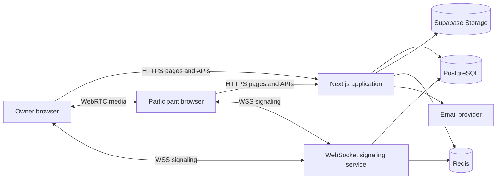
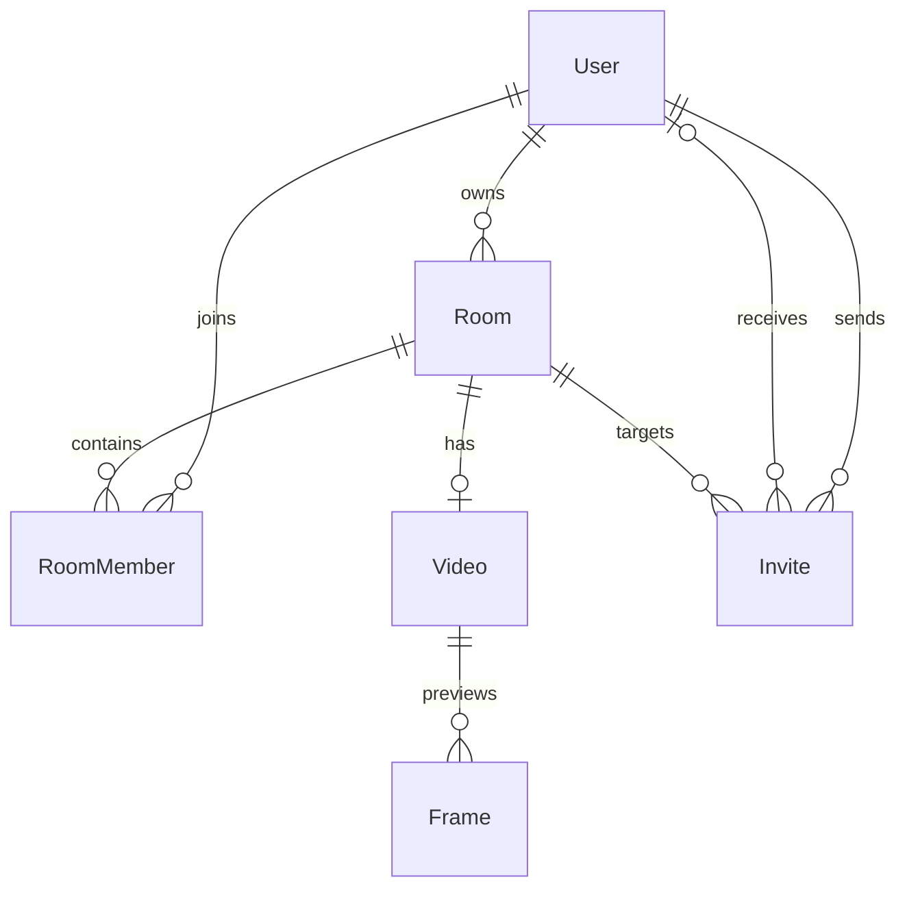

# Podcazt

Podcazt is a browser recording platform for solo sessions and remote podcasts. It combines a Next.js web application, peer-to-peer WebRTC calls, an authenticated WebSocket signaling service, PostgreSQL, Supabase Storage, Redis, and email delivery.

The room owner can invite a participant, start a live call, record the visible participant grid, and upload the final recording. Participants can control their own camera and microphone, but server-side checks prevent them from recording or managing the room.

## System architecture



The Next.js application handles pages, authentication, authorization, room data, invites, uploads, and the dashboard. The signaling service handles long-lived WebSocket connections. WebRTC sends live camera and microphone data directly between browsers. PostgreSQL stores relational data. Supabase Storage stores large video and image objects. Redis coordinates rate limits and realtime events across server instances.

### Why WebRTC and WebSocket are separate

WebRTC carries the audio and video. It is designed for low-latency media and can send media directly between browsers.

Before two browsers can create that connection, they must exchange small setup messages. These messages contain an offer, an answer, and ICE candidates. An ICE candidate describes a network path that WebRTC can try. The WebSocket service routes these setup messages to the correct peer. It does not carry the video itself.

STUN helps a browser discover its public network address. TURN relays media when a direct route is blocked by a firewall or strict network. TURN is important for reliable production calls.

## Runtime services

The project has two server processes:

1. The Next.js process serves the site and HTTP API.
2. The signaling process keeps WebSocket connections open and routes realtime messages.

Both processes use the same `SESSION_SECRET`. The Next.js process creates a short-lived realtime token. The signaling process verifies that token, reads the user identity from it, and checks room membership in PostgreSQL before allowing a room join.

Redis is optional for one signaling instance. It becomes important when several signaling instances are running because it broadcasts invite notifications across all instances. Without Redis, the Next.js process can send the event to the signaling service through its protected internal HTTP endpoint.

## Authentication and persistent sessions

Authentication is stateless. Stateless means the server does not store a session row for each signed-in browser.

After sign-up or login:

1. The password is checked with bcrypt.
2. The server creates a signed JWT.
3. The JWT is stored in an `HttpOnly` cookie for 30 days.
4. Each protected request verifies the JWT signature and claims.
5. The user identity is read from the token without a database query.

The JWT uses these checks:

- `HS256` is the only accepted signing algorithm.
- `sub` contains the user ID.
- `iss` identifies Podcazt as the issuer.
- `aud` limits the token to the Podcazt web application.
- `jti` gives each token a unique ID.
- `iat` records when the token was issued.
- `exp` ends the session after 30 days.
- `typ` separates session tokens from other token types.

The cookie is `HttpOnly`, so browser JavaScript cannot read it. `SameSite=Lax` reduces cross-site request attacks. Production cookies require HTTPS. Cookie priority is set to high so browsers are less likely to remove it under storage pressure.

`SESSION_SECRET_PREVIOUS` supports key rotation. During a rotation, new tokens use `SESSION_SECRET`, while old tokens can still be verified with the previous key. After the longest token lifetime has passed, the previous key can be removed.

Stateless sessions have a clear tradeoff: removing a server-side session is not needed, but one token cannot be revoked immediately without adding a deny list or a user session version. Logout removes the browser cookie. Secret rotation invalidates a wider group of tokens.

## Realtime room flow

1. A signed-in user opens a recording room.
2. The browser asks `/api/realtime-token` for a ten-minute signaling token.
3. The browser connects to the signaling service over `wss://`.
4. The signaling service verifies the token and registers the connection under the authenticated email.
5. The browser sends a room join message.
6. The signaling service checks whether the user owns the room or has a `RoomMember` row.
7. Existing peers are returned to the new peer.
8. Browsers exchange WebRTC offers, answers, and ICE candidates through the socket.
9. Camera and microphone tracks then move between browsers over WebRTC.
10. Heartbeat messages detect broken sockets and remove disconnected peers.

The client never chooses its trusted peer identity. The signaling server creates the peer ID and attaches the verified user identity. This prevents a client from joining as another user.

## Invite and notification flow

1. The owner submits a participant email.
2. The API verifies the JWT, room access, room type, room state, and ownership.
3. PostgreSQL stores one invite per room and email pair.
4. The API publishes an invite event through Redis or the protected signaling endpoint.
5. The signaling service finds sockets registered under the invited email.
6. The dashboard bell receives the event immediately and updates its count.
7. Email delivery sends the same invite link for users who are offline.
8. Accepting the invite creates an indexed `RoomMember` row and changes the invite status in one transaction.

No browser polling is used for new notifications. The initial notification list is loaded with the dashboard page, and later notifications arrive through the open socket.

## Recording and upload flow

Only the room owner can record. This rule exists in both the interface and the upload API.

The recorder creates an off-screen 1280 by 720 canvas. Every animation frame draws the active video elements into a grid. Web Audio combines the active audio streams. `MediaRecorder` records the canvas video track and the mixed audio track.

The upload is split into chunks and staged in IndexedDB. IndexedDB is the browser database. Unlike an in-memory array, it can hold large binary chunks without keeping the whole recording in JavaScript memory.

1. The browser records a chunk every two seconds.
2. Each chunk is committed to IndexedDB. Strict durability is requested when the browser supports it.
3. Recording stop waits for every local write to finish.
4. The browser reads the chunks back in index order and checks that no index is missing.
5. The browser calculates a SHA-256 hash for each chunk.
6. Chunks upload one at a time to Supabase Storage.
7. The server calculates the hash again and rejects changed data.
8. The completion request downloads the ordered chunks and joins them.
9. The final file is uploaded to `recordings/{videoId}/video.webm`.
10. PostgreSQL stores the storage path, MIME type, byte size, final SHA-256 hash, public link, and completion time.
11. A JPEG frame is uploaded to `recordings/{videoId}/preview.jpg`.
12. Temporary object-store chunks and local IndexedDB chunks are removed only after successful final assembly.

If upload fails, the local chunks remain available and the studio shows a retry action. Ending the room waits for an active upload, so leaving the page cannot silently interrupt the final transfer.

Temporary server chunks use `uploads/{recordingId}/chunks/{chunkIndex}.webm`. The random recording ID separates unfinished upload attempts. The final video ID already links to its room and owner in PostgreSQL, so permanent paths do not repeat those IDs.

Sequential upload avoids several simultaneous large requests. IndexedDB prevents the full recording from living only in memory. Hash verification detects transmission errors. A recording is visible on the dashboard only when `completedAt` is present, so an empty room is never shown as a pending video.

The studio reads WebRTC statistics every two seconds. It displays video frames encoded, sent, received, decoded, and dropped, plus lost RTP packets. RTP is the packet format used to carry WebRTC media. These counters show whether frames are flowing and whether the browser reports loss. WebRTC can recover from some network loss, but no realtime network can promise delivery of every captured frame.

## Normalized database design

Normalization means each fact has one main place in the database. It reduces duplicate values and prevents two copies of the same fact from becoming different.



### Tables

`users` stores identity, the bcrypt password hash, and profile fields.

`rooms` stores the room name, type, owner, creation time, and closing time. Room name and owner are not copied into the recording table.

`room_members` is an explicit join table. Its composite primary key is `(room_id, user_id)`, so one user cannot join the same room twice. The owner is represented by `rooms.room_owner_id`; only participants need membership rows.

`videos` stores one recording for one room. `room_id` is unique, which enforces the one-to-one relationship. Content metadata lives here because it describes the recorded object.

`frames` stores preview images for a recording. The newest frame can be selected by the `(video_id, created_at)` index.

`invites` stores one invitation per room and email pair. Re-sending a declined invite updates the same row instead of creating repeated data.

### Indexes and query speed

Indexes are shaped around application queries:

- `(room_id, user_id)` gives a fast logarithmic room membership lookup through a unique B-tree key.
- `(user_id, joined_at)` supports a user’s recent room memberships.
- `(room_owner_id, created_at)` supports recent owner rooms.
- `videos.room_id` supports the one-to-one room lookup.
- `videos.completed_at` supports completed recording order.
- `(video_id, created_at)` supports the latest preview frame.
- `(invited_email, status, created_at)` supports the notification list.
- `(inviter_id, created_at)` supports invite history.
- `(room_id, invited_email)` prevents duplicate invites and gives direct invite lookup.

Room authorization now uses one filtered query with an indexed membership existence check. It does not load every room member. The roster is fetched only on the recording page, where the names are actually displayed.

The authenticated layout loads active invites once for the persistent notification bell. The dashboard performs a separate focused query that selects only completed videos and the newest frame. Realtime invite events update the shared bell after the initial page load.

## Authorization boundaries

Authentication answers “who is this user?” Authorization answers “may this user perform this action?”

The main authorization rules are:

- A room owner can invite participants, record, upload frames, and close the room.
- A participant can join only after accepting an invite.
- A participant can control only local camera and microphone tracks.
- A closed room cannot be joined or accepted.
- An invite can be accepted only by the email address that received it.
- The signaling service repeats the room membership check instead of trusting the web page.

Hiding a button is not treated as security. Sensitive API routes repeat the owner check because a user can call an HTTP endpoint without using the page.

## Rate limiting and distributed state

API routes call a shared rate-limit helper. If `REDIS_URL` is available, standard Redis stores counters. Upstash REST is supported for serverless HTTP deployments. A process-memory fallback keeps local development working.

Redis is also used as pub/sub. Pub/sub means one process publishes an event to a channel and every subscribed process receives it. This allows any Next.js instance to reach a user connected to any signaling instance.

The WebSocket service keeps active sockets in memory because sockets belong to one running process. Redis distributes events, while each process sends the final message to its own connected sockets.

## Storage design

PostgreSQL stores metadata and relationships. Supabase Storage stores video chunks, completed recordings, and preview images. Keeping large binary objects outside PostgreSQL prevents large table rows and makes object delivery easier to scale.

Temporary chunks use a random recording ID. Permanent video and preview objects use the normalized video ID. Authorization and ownership remain in PostgreSQL instead of being repeated in object paths.

The project currently uses Supabase public URLs. A private production library can replace these with short-lived signed URLs without changing the normalized recording relationship.

## Failure handling

- Invalid JWTs return an unauthorized response.
- Invalid input is rejected by Zod before database work starts.
- Database room creation and invite acceptance use transactions.
- Duplicate invitations are blocked by both application checks and a unique database index.
- Socket messages have a size limit and invalid messages are ignored.
- Socket heartbeats remove dead peer connections.
- Missing recording chunks stop final assembly.
- Hash mismatches stop the upload.
- Email failure does not remove the database invite.
- Realtime delivery can fall back from Redis to the protected signaling endpoint.
- A TURN server provides a media fallback when direct WebRTC paths fail.

## Source file map

### Root files

| File | Responsibility |
| --- | --- |
| `.env.example` | Lists application, database, storage, email, Redis, signaling, TURN, and JWT key-rotation settings. |
| `README.md` | Describes system architecture, data flow, security, deployment, and source ownership. |
| `package.json` | Defines dependencies and commands for Next.js, Prisma, linting, type checking, and the signaling service. |
| `package-lock.json` | Locks exact dependency versions for repeatable installs. |
| `next.config.ts` | Separates development and production build directories, enables strict React behavior, removes the framework header, and adds browser security headers. |
| `next-env.d.ts` | Adds generated Next.js TypeScript declarations. It is managed by Next.js. |
| `tsconfig.json` | Configures strict TypeScript, browser libraries, module resolution, JSX, and the `@/` path alias. |
| `eslint.config.mjs` | Applies Next.js, React, accessibility, and TypeScript lint rules. |

### Pages and layouts

| File | Responsibility |
| --- | --- |
| `app/layout.tsx` | Defines document metadata and the shared shell. It verifies the stateless session, applies the authenticated body theme, loads initial invites, and keeps the notification bell in every signed-in page. |
| `app/globals.css` | Contains public and authenticated design tokens, full-page black overscroll styling, responsive navigation, studio grid, recording controls, cards, forms, dashboard, and notification popover styles. |
| `app/page.tsx` | Renders the public landing page. |
| `app/signin/page.tsx` | Renders the combined account creation and login screen. |
| `app/login/page.tsx` | Redirects the old `/login` path to `/signin`. |
| `app/dashboard/page.tsx` | Verifies the JWT, loads completed recordings with their newest preview frame, and renders the recording library. |
| `app/create/page.tsx` | Protects and renders the room creation page. |
| `app/permissions/page.tsx` | Protects and renders the camera and microphone preflight step. |
| `app/record/[roomId]/page.tsx` | Verifies room access, loads the roster, decides whether the user is the owner, and renders the realtime studio. |
| `app/invite/[inviteId]/page.tsx` | Validates an invite against the signed-in email and renders its acceptance state. |
| `app/ended/page.tsx` | Shows the room-ended result and links back to the dashboard. |

### Client components

| File | Responsibility |
| --- | --- |
| `components/AuthForm.tsx` | Switches between sign-up and login, validates browser fields, calls the auth API, and refreshes the authenticated route state. |
| `components/CreateRoomForm.tsx` | Creates podcast or solo rooms and moves the owner to device permissions. |
| `components/PermissionGate.tsx` | Requests real browser media permission, stops the test stream, and enters the selected room. |
| `components/Recorder.tsx` | Owns local media, WebSocket signaling, WebRTC peer connections, frame transport statistics, the participant grid, owner-only composite recording, local chunk staging, hashing, upload, frame capture, and room exit. |
| `components/InviteParticipant.tsx` | Lets the owner create an email and realtime invite and shows delivery status. |
| `components/AcceptInviteButton.tsx` | Accepts an invite and sends the participant to the permission step. |
| `components/NotificationBell.tsx` | Stays mounted in the authenticated navigation, opens a notification socket, adds invite events without polling, removes accepted invites, displays the active count, and links to invite pages. |
| `components/ProfileMenu.tsx` | Opens from the authenticated profile icon on hover or keyboard focus, shows the current identity, clears the JWT cookie through the logout API, and returns to the public homepage. |

### Authentication and shared server libraries

| File | Responsibility |
| --- | --- |
| `lib/auth.ts` | Creates and verifies 30-day stateless JWT sessions, handles secure cookies, memoizes verification per request, and supports signing-key rotation. |
| `lib/realtime-token.ts` | Creates and verifies short-lived JWTs used only by the WebSocket signaling service. |
| `lib/types.ts` | Holds shared TypeScript shapes, including the trusted session user. |
| `lib/env.ts` | Reads required and optional environment variables and resolves a safe public application origin. |
| `lib/prisma.ts` | Creates one reusable Prisma client per server process and avoids extra clients during development reloads. |
| `lib/api.ts` | Provides consistent JSON success, error, and rate-limit responses. |
| `lib/validation.ts` | Defines Zod schemas for credentials, rooms, invites, upload chunks, completion messages, and preview frames. |
| `lib/client-error.ts` | Extracts safe, readable messages from API failures for client components. |
| `lib/rooms.ts` | Converts room kinds, creates normalized room and recording rows in one transaction, performs indexed access checks, and loads the roster only when needed. |
| `lib/control-route.ts` | Provides shared authentication and room validation for compatibility control endpoints. Media changes themselves stay local to WebRTC tracks. |

### Realtime, cache, email, and storage libraries

| File | Responsibility |
| --- | --- |
| `lib/realtime-client.ts` | Fetches a realtime token and builds the correct development or production WebSocket URL. |
| `lib/realtime-events.ts` | Publishes invite notifications through Redis or the protected signaling HTTP endpoint. |
| `lib/recording-store.ts` | Stores ordered recording chunks in IndexedDB before upload, reads them back for verification, and removes them after successful completion. |
| `lib/redis.ts` | Creates a reusable standard Redis client and an Upstash REST command client. |
| `lib/rate-limit.ts` | Implements request limits with standard Redis, Upstash REST, or an in-memory development fallback. |
| `lib/email.ts` | Builds escaped text and HTML invitation messages, chooses the public invite URL, and sends through Gmail. |
| `lib/supabase.ts` | Creates the server storage client and exposes browser storage configuration. |

### Authentication API routes

| File | Responsibility |
| --- | --- |
| `app/api/signin/route.ts` | Validates account data, hashes the password, creates the user, and writes the persistent JWT cookie. |
| `app/api/login/route.ts` | Finds the user, compares the bcrypt hash, and writes the persistent JWT cookie. |
| `app/api/logout/route.ts` | Removes the session cookie. |
| `app/api/me/route.ts` | Returns the verified identity from the JWT without loading the user from PostgreSQL. |
| `app/api/realtime-token/route.ts` | Exchanges the persistent web session for a short-lived signaling token. |

### Room and invite API routes

| File | Responsibility |
| --- | --- |
| `app/api/create/route.ts` | General room creation endpoint with validated room type. |
| `app/api/podcast/route.ts` | Creates a podcast room and its empty recording metadata row. |
| `app/api/self-record/route.ts` | Creates a solo room and its empty recording metadata row. |
| `app/api/inviteOther/route.ts` | Enforces owner-only invites, reuses the normalized invite row, publishes realtime events, and sends email. |
| `app/api/incomingInvites/route.ts` | Returns active invites for the authenticated email. |
| `app/api/incomingInvities/route.ts` | Keeps compatibility with the earlier misspelled incoming-invites URL by exporting the correct handler. |
| `app/api/invites/[inviteId]/accept/route.ts` | Checks invite ownership and room state, then creates membership and marks acceptance in one transaction. |
| `app/api/leaveCall/route.ts` | Lets a participant leave and marks the room closed when the owner ends it. |
| `app/api/closeRoom/route.ts` | Provides a direct owner-only room closing endpoint. |

### Recording and media API routes

| File | Responsibility |
| --- | --- |
| `app/api/record/route.ts` | Accepts owner-only hashed chunks under the temporary upload path, verifies and assembles them, saves the final video under its video ID, writes metadata, and removes temporary remote chunks. |
| `app/api/frame/route.ts` | Uploads an owner-only JPEG preview beside the final video and links it to the recording. |
| `app/api/myVideos/route.ts` | Returns only completed recordings with room data and the newest frame. BigInt byte size is converted to a JSON string. |
| `app/api/allowCam/route.ts` | Confirms that an authenticated user completed the camera permission step. |
| `app/api/allowMic/route.ts` | Confirms that an authenticated user completed the microphone permission step. |
| `app/api/cam/route.ts` | Compatibility endpoint that validates authenticated room camera control messages. |
| `app/api/mic/route.ts` | Compatibility endpoint that validates authenticated room microphone control messages. |
| `app/api/raiseHand/route.ts` | Compatibility endpoint for an authenticated room hand-state message. |
| `app/api/shareScreen/route.ts` | Compatibility endpoint for an authenticated room screen-sharing state message. |

### Signaling service

| File | Responsibility |
| --- | --- |
| `server/signaling.ts` | Runs Express and WebSocket on one HTTP server, authenticates upgrades, checks database room membership, assigns peer IDs, routes SDP and ICE messages, sends room events, delivers invite notifications, supports Redis pub/sub, performs heartbeat cleanup, and handles graceful shutdown. |

### Database files

| File | Responsibility |
| --- | --- |
| `prisma/schema.prisma` | Defines normalized PostgreSQL models, one-to-one recording ownership, explicit room membership, invite uniqueness, cascade rules, and query-shaped indexes. |
| `prisma/manual/normalize_existing.sql` | Converts a database created with the older implicit membership and duplicated video model. It preserves memberships and recordings, removes duplicated fields, deduplicates invites, and runs inside one transaction. |

## Local setup

1. Copy the environment template.

```bash
cp .env.example .env
```

2. Set a PostgreSQL connection and a random `SESSION_SECRET` containing at least 32 characters.

3. Install dependencies and generate the Prisma client.

```bash
npm install
npm run db:generate
```

4. For a new empty database, create the normalized tables.

```bash
npm run db:push
```

5. For a database that already uses the older schema, back it up and apply the one-time conversion instead of `db:push`.

```bash
psql "$DATABASE_URL" -f prisma/manual/normalize_existing.sql
npm run db:generate
```

6. Start Next.js and the signaling service in separate terminals.

```bash
npm run dev
npm run dev:signal
```

Local signaling defaults to `ws://localhost:4000`. Camera access works on localhost. Production camera and microphone access require HTTPS.

## Environment variables

### Application and authentication

- `NEXT_PUBLIC_APP_URL`: public HTTPS origin used in invite links.
- `SESSION_SECRET`: current JWT signing key. Use at least 32 random characters.
- `SESSION_SECRET_PREVIOUS`: optional previous JWT key during rotation.
- `DATABASE_URL`: PostgreSQL connection used by Prisma.

### Signaling and WebRTC

- `NEXT_PUBLIC_SIGNALING_URL`: public `wss://` signaling address.
- `SIGNALING_PORT`: signaling process port.
- `SIGNALING_INTERNAL_URL`: private HTTP address used for direct invite event delivery.
- `SIGNALING_INTERNAL_SECRET`: bearer secret protecting internal event delivery.
- `NEXT_PUBLIC_TURN_URL`: TURN server URL.
- `NEXT_PUBLIC_TURN_USERNAME`: temporary TURN username.
- `NEXT_PUBLIC_TURN_CREDENTIAL`: temporary TURN credential.

### Storage

- `NEXT_PUBLIC_SUPABASE_URL`: Supabase project URL.
- `NEXT_PUBLIC_SUPABASE_ANON_KEY`: limited browser key.
- `SUPABASE_SERVICE_ROLE_KEY`: private server storage key.
- `SUPABASE_VIDEOS_BUCKET`: object bucket for chunks, recordings, and frames.

### Redis

- `REDIS_URL`: standard Redis connection for pub/sub and rate limiting.
- `UPSTASH_REDIS_REST_URL`: Upstash REST endpoint for serverless rate limiting.
- `UPSTASH_REDIS_REST_TOKEN`: Upstash REST credential.

### Email

- `GOOGLE_EMAIL`: Gmail account used as the sender.
- `GOOGLE_APP_PASSWORD`: Google application password.
- `GOOGLE_FROM_NAME`: visible sender name.

## Commands

| Command | Purpose |
| --- | --- |
| `npm run dev` | Starts the Next.js development server. |
| `npm run dev:signal` | Starts the signaling service with `.env`. |
| `npm run build` | Produces and validates the optimized Next.js build. |
| `npm run start` | Starts the built Next.js application. |
| `npm run start:signal` | Starts the signaling service in production mode. |
| `npm run lint` | Runs ESLint. |
| `npm run typecheck` | Runs strict TypeScript checking without output files. |
| `npm run db:generate` | Regenerates the Prisma client after schema changes. |
| `npm run db:push` | Synchronizes an empty or development database with the Prisma schema. |
| `npm run db:studio` | Opens Prisma Studio for database inspection. |

## Production layout

Run the Next.js process behind HTTPS. Run the signaling process on infrastructure that supports persistent WebSocket connections. Expose it through `wss://` and keep its internal event endpoint private.

Use PostgreSQL connection pooling for serverless Next.js instances. Set `REDIS_URL` on the signaling service when more than one signaling instance can run; Redis relays peer presence, SDP, ICE candidates, room endings, and notifications between instances. Use a TURN service with temporary credentials. Keep Supabase service keys, Gmail credentials, database URLs, JWT secrets, and internal signaling secrets on the server.

The Next.js process can scale horizontally because sessions are stateless and uploaded objects live outside the process. The signaling process can also scale horizontally when Redis distributes notifications. WebRTC media stays between peers or passes through TURN, so the application servers do not become the main video bandwidth path.
